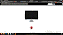
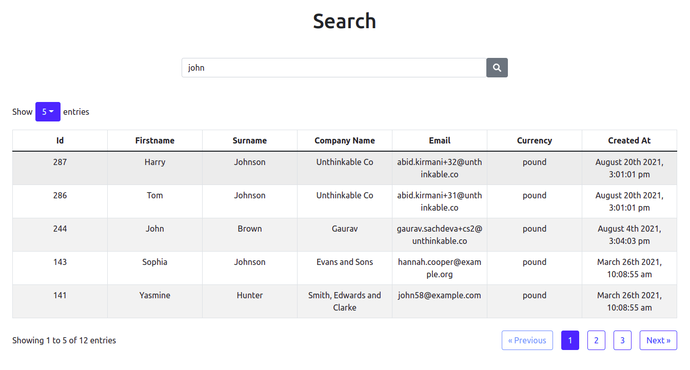

# unthinkable-react-search

### A ReactJS component to render a searching and pagination.

> By using this component, get all the functionalities which are related to pagination and searching by passing a small amount of data.
>
> > You can get the default styling or you can add the styling which you want.

## Requirements

1. Required node version `>=17.0.0`
2. Required npm verison `>=8.0.0`
3. Required react version `18.0.0`

## Installation

1. Clone the repository - **[Clone Repo from here](https://github.com/nefoyoch/unthinkable-react-search/)**
3. run `npm i`
4. Create a build -


         a. for windows user - run `npm run build:win`
         b. for linux user - run `npm run build:linux`
         
         
      **NOTE** - Folder with name `dist` is created in root directory.
 
 
5. run `npm link`
6. run `npm link ../path/to/your/project/node_modules/react`

> Now, move into the project in which you want to use this package, use your existing react-app or create a new one by following command-

- create a react app `npx create-react-app <app_name>`
- run `npm link unthinkable-react-search`
- Now your app is ready to use this package.





## Usage

> Open the file in which you want to use pagination and searching (_for e.g. App.js_)

```JSX
import { ReactSearch } from "unthinkable-react-search"
```

> _Get the default styles by passing data as props_ and run `npm start` to run your react application-

```JSX
<ReactSearch
   endPoint={<API>}
   tableType={<TABLETYPE>}
   isSearchResults={true}
   isPagination={true}
   pageSizeOptions={<PAGE_SIZE_OPTIONS>}
/>
```



#### Customize the Package with Props

| Name                    | Type               | Description                                                                                            |
| ----------------------- | ------------------ | ------------------------------------------------------------------------------------------------------ |
| `endPoint`              | `String`           | **Required**. API for fetching data which is to be displayed.                                          |
| `tableType`             | `String`           | **Required**. Type of the table `e.g. users/students`                                                  |
| `isSearchResults`       | `Boolean`          | **Required**. To display Search Results. `Pass value as false if not required.`                        |
| `isPagination`          | `Boolean`          | **Required**. To get functionalities of pagination. `Pass value as false if not required.`             |
| `defaultPageSize`       | `Number`           | Number of rows to be displayed. `default: 5`                                                           |
| `pageSizeOptions`       | `Array`            | Items to be displayed on dropdown menu `e.g. [5, 10, 15, 20]`, if not required do not write this prop. |
| `searchPlaceholderText` | `String`           | Text to be displayed on Search Bar. `default: Search...`                                               |
| `omittedHeaders`        | `Array`            | Headers which you do not want to be displayed.                                                         |
| `wordWrap`              | `Array of Objects` | Pass the headers and ellipsis property `true`, if you want to use tooltip on table cells on hover. `   |
| `tableStyling`          | `Object`           | Styles of the table to be displayed.                                                                   |
| `searchIconVariant`     | `String`           | Color of a Search Bar Icon `default: secondary`.                                                       |
| `dropDownVariant`       | `String`           | Color of a Drop-Down menu. `default: primary`                                                          |
| `paginateBtnVariant`    | `String`           | Color of pagination buttons. `default: outline-primary`                                                |
| `dateTimeFormat`        | `String`           | Format of date & time (if present). `default: MMMM DD YYYY, h:mm:ss a`                                 |

- endPoint - **API Format**
  > e.g.

```JSON
{
   "users":{
      "current_page":1,
      "data":[
         {
            "id":316,
            "firstname":"Rt",
            "surname":"We",
            "company_name":"Prachi.gupta+t1@unthinkable.co",
            "email":"ae@wef.sd",
            "currency":"pound",
            "created_at":"2021-09-08T09:22:21.000000Z",
            "fullname":"Rt We",
            "plan_status":"Expired",
            "owner_id":0,
            "active_subscription":null,
            "group":null
         }
      ],
      "first_page_url":"https://divisus-admin.cloudzmall.com/api/unthinkable/search?q=sd&per_page=1&table=users&page=1",
      "from":1,
      "last_page":1,
      "last_page_url":"https://divisus-admin.cloudzmall.com/api/unthinkable/search?q=sd&per_page=1&table=users&page=1",
      "links":[
         {
            "url":null,
            "label":"&laquo; Previous",
            "active":false
         },
         {
            "url":"https://divisus-admin.cloudzmall.com/api/unthinkable/search?q=sd&per_page=1&table=users&page=1",
            "label":"1",
            "active":true
         },
         {
            "url":null,
            "label":"Next &raquo;",
            "active":false
         }
      ],
      "next_page_url":null,
      "path":"https://divisus-admin.cloudzmall.com/api/unthinkable/search",
      "per_page":1,
      "prev_page_url":null,
      "to":1,
      "total":1,
      "keys":[
         "id",
         "firstname",
         "surname",
         "company_name",
         "email",
         "currency",
         "created_at"
      ]
   }
}
```

> **NOTE** - _Refer to React Bootstrap for styling purpose_.

- _tableStyling_:

  > e.g.

  ```JSX
           tableStyling={{
              size: "",
              variant: "",
              bordered: <boolean>,
              striped: <boolean>,
              hover: <boolean>,
           }}
  ```

  > `size: "md"/"sm"` `default: ""`

  > `variant: "dark"/""` `default: ""`

- _wordWrap_:
  > e.g.
  ```JSX
         wordWrap={[
           {
              header: "email",
              ellipsis: true,
           },
         ]}
  ```
  > pass the name of the `header` and `ellipsis` true, to aplly functionality of tooltip on table cells.

> _Passing all props in a component_ - `e.g.`

```JSX
  <ReactSearch
      endPoint={<API>}
      tableType={<TABLE>}
      defaultPageSize={<DEFAULT_PAGE_SIZE>}
      pageSizeOptions={<PAGE_SIZE_OPTIONS>}
      isSearchResults={true}
      isPagination={true}
      searchPlaceholderText="Search Me"
      omittedHeaders={["currency", "created_at"]}
      wordWrap={[
        {
          header: "email",
          ellipsis: true,
        },
      ]}
      tableStyling={{
        size: "sm",
        variant: "dark",
        bordered: true,
        striped: true,
        hover: false,
      }}
      searchIconVariant="success"
      dropDownVariant="success"
      paginateBtnVariant="outline-success"
      dateTimeFormat="MMMM DD YYYY"
  />
```

> _Now it looks like_ -


## Credits

      - Neelkanth Kaushik (neelkanth.kaushik@daffodilsw.com) - Associate Manager - Software Engineering
      - Taneer Kaur (tanveer.kaur@unthinkable.co) - Sr. Associate - Software Engineering
      - Ayush Gupta (ayush@unthinkable.co) - Intern

